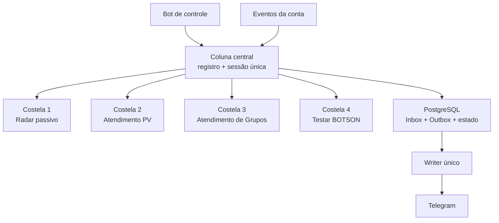
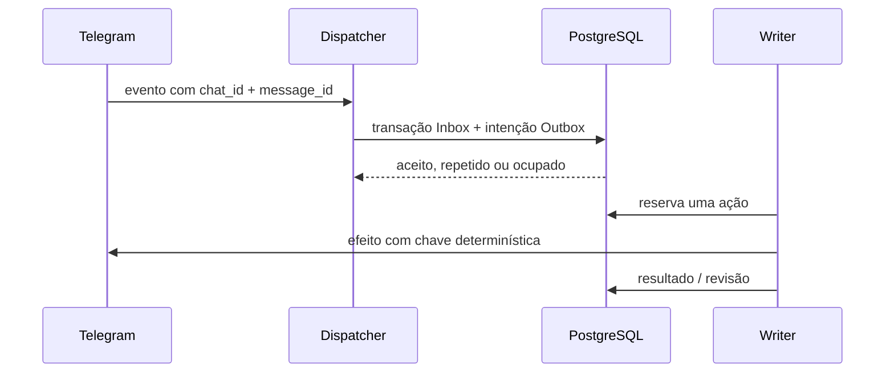
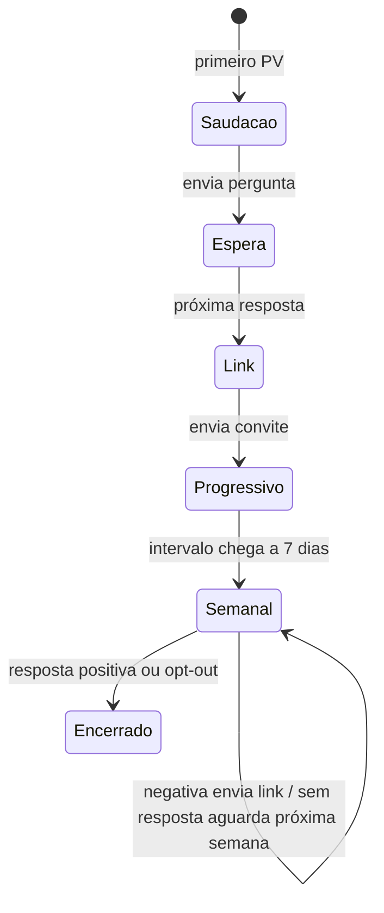

# Arquitetura — espinha de peixe

## Visão geral

A coluna central possui a conexão, o ciclo de vida, a ordem dos módulos e o
despacho de eventos. Uma costela conhece apenas seu próprio caso de uso:

| Componente | Pode ler Telegram | Pode gravar banco | Pode agir no Telegram |
|---|---:|---:|---:|
| Coluna central | sim | estado operacional | somente conexão |
| Radar | sim | sim | não |
| Atendimento PV | eventos privados | via contrato | somente pelo Writer |
| Atendimento de Grupos | grupos autorizados + posts próprios | via contrato | somente pelo Writer |
| Testar BOTSON | sim | via contrato | somente pelo Writer |
| Painel | não pela conta | sim | responde pelo bot de controle |
| Writer | não decide regra | diário de efeitos | sim, serialmente |

O painel é um canal administrativo. A resposta de confirmação não é estado
autoritativo: se ela falhar, `status` consulta novamente o PostgreSQL.

## Regra de composição

`MODULES`, `COMMANDS` e `CAMPAIGNS`, em `gr_observer/catalog.py`, são
dicionários cuja ordem é explícita. IDs como `radar.enable`, `pv.greeting`,
`group_reply.enable` e `botson.run` são contratos; o texto pode ganhar aliases
sem alterar a operação.

Toda costela deve ser registrada **explicitamente** pela coluna central. É
proibido adicionar módulos por efeito colateral de importação, alterar
`Observer.setup`, `ControlPanel`, `MODULES` ou `COMMANDS` por monkey patch ou
abrir outra `TelegramClient` de usuário. Integrações auxiliares podem fornecer
adaptadores, mas a composição é chamada pelo `application.Observer`.

No fluxo de eventos da conta, a ordem de despacho também vem do catálogo:
BOTSON (comandos), Atendimento PV, Atendimento de Grupos e Radar. Um comando
consumido pelo BOTSON não vira atendimento nem falsa origem no Radar. Um PV
comum passa pelo Atendimento e ainda chega ao Radar para eventual origem
provável. Eventos de grupo podem ser avaliados pelo Atendimento de Grupos e
continuar para o Radar. Não existe chamada direta de uma costela para a outra.

## Dual Write

Propriedades:

- `inbox_events` elimina repetição do mesmo update;
- `outbox_actions.action_key` elimina repetição da mesma intenção;
- `outbox_actions.available_at` mantém atrasos e agenda semanal no banco;
- só há um `OutboxWriter` por sessão;
- `telegram_effects.effect_key` registra cada efeito antes da chamada externa;
- texto usa `random_id` determinístico aceito pela API do Telegram;
- entrada e saída reconciliam o estado de membro antes de qualquer repetição;
- callback ambíguo nunca é repetido automaticamente;
- processos interrompidos movem ações/efeitos para `review` após o novo processo
  obter a trava exclusiva da sessão;
- resultado de teste + intenção de entregar relatório são uma transação única;
- cada avanço do Atendimento PV atualiza seu estado e cria a próxima intenção
  agendada na mesma transação;
- respostas e republicações do Atendimento de Grupos também atravessam Outbox +
  Writer; a costela nunca envia diretamente.

Isso não promete “exactly once” mágico entre PostgreSQL e Telegram. O contrato
é: deduplicar onde existe chave/idempotência, reconciliar onde o estado pode ser
lido e exigir revisão onde o efeito externo ficou ambíguo.

## Estado do Atendimento PV

O texto recebido não atravessa a fronteira de persistência. O módulo reduz a
resposta a `unknown`, `positive`, `negative` ou `opt_out`. Essa classificação só
controla o link e o encerramento; mensagens ambíguas não recebem resposta
automática adicional.

## Atendimento de Grupos

A costela nasce desligada. `GROUP_REPLY_ALLOWLIST` define alvos iniciais, mas
uma postagem manual de texto também pode autorizar dinamicamente o grupo e
passar a ser o modelo de republicação. Isso exige que a costela possa ser ligada
mesmo com allowlist vazia.

Eventos e modelos ficam no PostgreSQL. Resposta atrasada e republicação são
intenções da Outbox. O módulo não faz DDL para se registrar na arquitetura: o
estado `group_reply` e suas tabelas pertencem ao schema central.

## Trava de sessão não é Dual Write

`AuthKeyDuplicatedError` é outro problema: concorrência de dois processos com a
mesma StringSession. Uma trava consultiva de sessão PostgreSQL cobre o pequeno
overlap de deploys do Railway **quando os processos usam o mesmo banco**. Ela
não substitui Inbox/Outbox e não permite que um segundo serviço, computador ou
processo use a mesma chave.

Uma chave que já recebeu `AuthKeyDuplicatedError` deve ser considerada
invalidada. Não se tenta “recuperá-la”: gera-se uma nova StringSession exclusiva,
substitui-se `USER_SESSION_STRING` e mantém-se a anterior apenas como arquivo
arquivado, nunca como credencial ativa. `Sessão única: online` só pode ser
exibido depois de o Telegram confirmar autorização; a mera existência de um
objeto `TelegramClient` não conta como sessão online.

## Como adicionar outra costela

1. Defina o módulo em `MODULES` com ID e ordem estáveis.
2. Defina seus comandos/aliases em `COMMANDS`.
3. Implemente `on_connect`, `on_disconnect` e, se necessário, o consumidor de
   eventos.
4. Registre a costela explicitamente em `Observer.setup` (ou por função chamada
   explicitamente por ele); nunca por side effect de importação.
5. Para ação ativa, registre um tipo na Outbox e use `TelegramEffects`.
6. Não passe a outra costela como dependência.
7. Cubra catálogo, composição, isolamento, idempotência e bloqueios de segurança
   em testes.

Uma função que apenas lê pode ter seu próprio job interno. Uma função que envia,
clica, entra, sai, apaga ou republica sempre atravessa Outbox + Writer.

Referências:

- [Transactional Outbox](https://microservices.io/patterns/data/transactional-outbox.html)
- [AWS — Transactional Outbox Pattern](https://docs.aws.amazon.com/prescriptive-guidance/latest/cloud-design-patterns/transactional-outbox.html)
