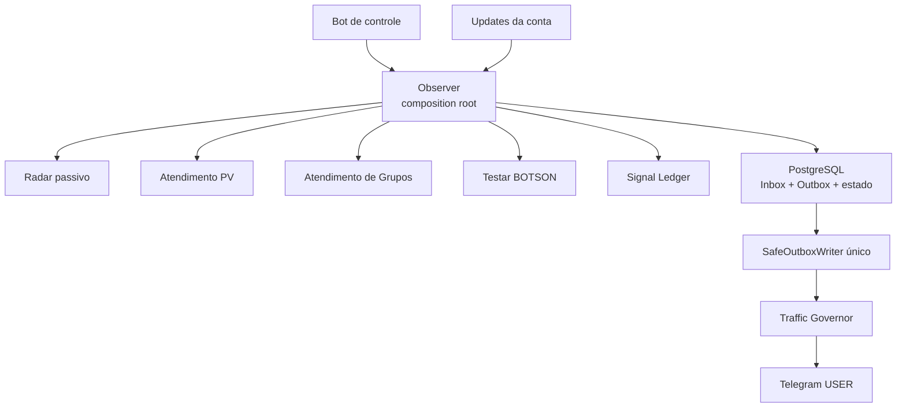

# Arquitetura — espinha de peixe

## Visão geral

`gr_observer.application.Observer` é o único composition root e o único dono do
`user_runtime`. A sessão USER, o Writer e o ciclo de vida não são recompostos por
mixins de produção.

## Espinha

O núcleo cria e coordena explicitamente:

- uma sessão Telegram USER (`DurableTelegramClient`);
- um `DurablePeerStore` para referências de peers;
- um `SignalLedger` para fatos neutros recebidos por updates;
- um `SafeOutboxWriter` para todas as mutações da sessão USER;
- um `TrafficGovernor` persistente usado pelo Writer;
- um `FloodMonitor` somente de observabilidade;
- o registry dos módulos e o painel de controle.

O bot de controle usa `MemorySession` própria de bot; isso não cria uma segunda
sessão USER nem um segundo Writer de mutações da conta.

## Costelas

- `pv_reply`: `PvReplyProduction`, com jornada, contatos, cópia editável,
  serialização por contato e proteção de contexto das continuações.
- `group_reply`: fluxo autorizado de grupos, registrado explicitamente pelo
  composition root.
- `radar`: `PassiveRadarModule`, dirigido por updates e auditorias pontuais; não
  inicia crawler periódico em produção.
- `botson`: homologação isolada, usando o mesmo Writer quando executa mutações USER.

Uma costela não cria outro Telegram USER client, Outbox ou Writer.

## Caminho de escrita Telegram

Toda mutação USER segue:

`módulo -> outbox_actions -> SafeOutboxWriter -> SafeTelegramEffects -> Telegram`

Efeitos recebem chave idempotente em `telegram_effects`. FloodWait não segura o
Writer: o Governor grava cooldown e devolve a ação para `pending` com
`available_at`. O registro do efeito é preservado e reaberto depois do cooldown;
não há exclusão de histórico para retry.

## Peer resolution

`DurableTelegramClient` herda normalmente de `TelegramClient`. Se a cache do
Telethon não resolver um usuário positivo, consulta `DurablePeerStore`. Se ainda
não existir referência, a ação é estacionada até um update real daquele usuário
fornecer novamente o `access_hash`.

Nenhum método de `TelegramClient` ou `Storage` é substituído em runtime.

## Radar

O Radar de produção não chama o crawler legado ao conectar. Novos updates podem
alimentar inventário e sinais; auditorias direcionadas continuam disponíveis sem
transformar a conexão em polling amplo.

## Contrato estrutural

`test_architecture_cleanliness.py` e `test_no_legacy_overlay_imports.py` protegem
no CI os invariantes de sessão única, Writer único, runtime único, ausência de
monkey-patches e ausência dos overlays históricos.
