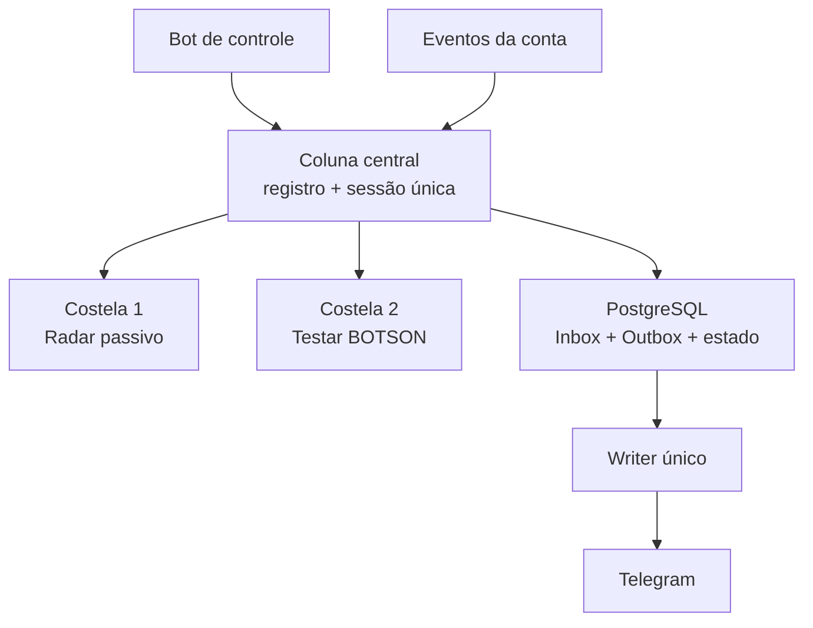
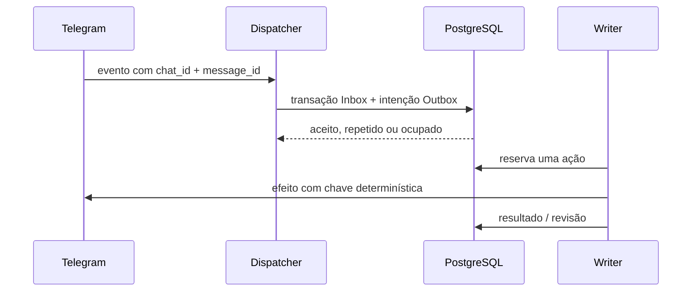

# Arquitetura — espinha de peixe

## Visão geral

A coluna central possui a conexão, o ciclo de vida, a ordem dos módulos e o
despacho de eventos. Uma costela conhece apenas seu próprio caso de uso:

| Componente | Pode ler Telegram | Pode gravar banco | Pode agir no Telegram |
|---|---:|---:|---:|
| Coluna central | sim | estado operacional | somente conexão |
| Radar | sim | sim | não |
| Testar BOTSON | sim | via contrato | somente pelo Writer |
| Painel | não pela conta | sim | responde pelo bot de controle |
| Writer | não decide regra | diário de efeitos | sim, serialmente |

O painel é um canal administrativo. A resposta de confirmação não é estado
autoritativo: se ela falhar, `status` consulta novamente o PostgreSQL.

## Ordem e isolamento

`MODULES` e `COMMANDS`, em `gr_observer/catalog.py`, são dicionários cuja ordem
é explícita. IDs como `radar.enable` e `botson.run` são contratos; o texto pode
ganhar aliases sem alterar a operação.

No fluxo de eventos da conta, comandos operacionais são avaliados antes da
observação passiva. Um comando consumido pelo BOTSON não vira falsa origem de
PV no Radar. Eventos normais seguem para o Radar. Não existe chamada direta de
uma costela para a outra.

## Dual Write

Propriedades:

- `inbox_events` elimina repetição do mesmo update;
- `outbox_actions.action_key` elimina repetição da mesma intenção;
- só há um `OutboxWriter` por sessão;
- `telegram_effects.effect_key` registra cada efeito antes da chamada externa;
- texto usa `random_id` determinístico aceito pela API do Telegram;
- entrada e saída reconciliam o estado de membro antes de qualquer repetição;
- callback ambíguo nunca é repetido automaticamente;
- processos interrompidos movem ações/efeitos para `review` após o novo processo
  obter a trava exclusiva da sessão;
- resultado de teste + intenção de entregar relatório são uma transação única.

Isso não promete “exactly once” mágico entre PostgreSQL e Telegram. O contrato
é: deduplicar onde existe chave/idempotência, reconciliar onde o estado pode ser
lido e exigir revisão onde o efeito externo ficou ambíguo.

Referências:

- [Transactional Outbox](https://microservices.io/patterns/data/transactional-outbox.html)
- [AWS — Transactional Outbox Pattern](https://docs.aws.amazon.com/prescriptive-guidance/latest/cloud-design-patterns/transactional-outbox.html)

## Trava de sessão não é Dual Write

`AuthKeyDuplicatedError` é outro problema: concorrência de dois processos com a
mesma StringSession. Uma trava consultiva de sessão PostgreSQL cobre o pequeno
overlap de deploys do Railway. Ela não substitui Inbox/Outbox e não permite que
um segundo serviço use a mesma chave.

## Como adicionar outra costela

1. Defina o módulo em `MODULES` com ID e ordem estáveis.
2. Defina seus comandos/aliases em `COMMANDS`.
3. Implemente `on_connect`, `on_disconnect` e, se necessário, o consumidor de
   eventos.
4. Para ação ativa, registre um tipo na Outbox e use `TelegramEffects`.
5. Não passe a outra costela como dependência.
6. Cubra comandos, isolamento, idempotência e bloqueios de segurança em testes.

Uma função que apenas lê pode ter seu próprio job interno. Uma função que envia,
clica, entra ou sai sempre atravessa Outbox + Writer.
